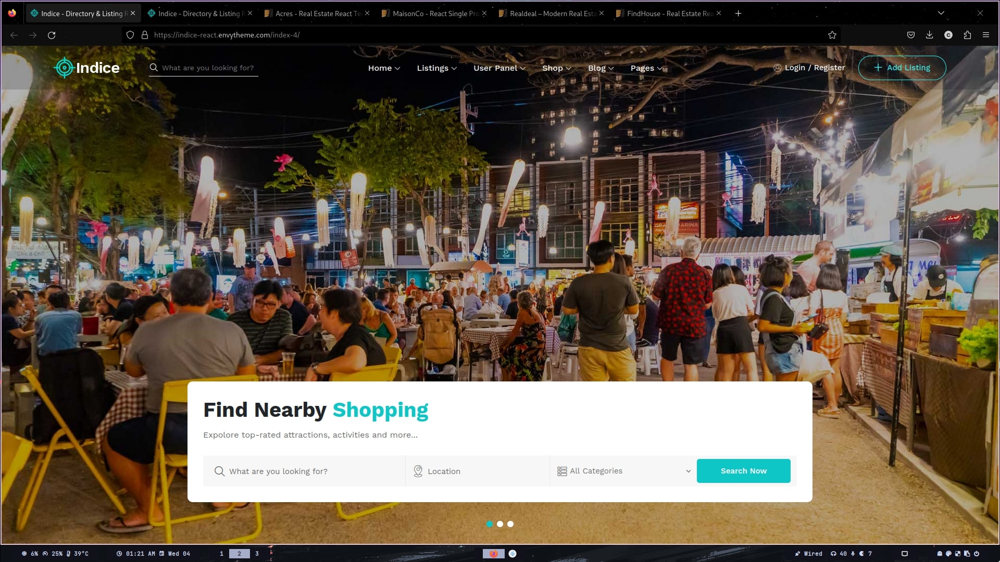
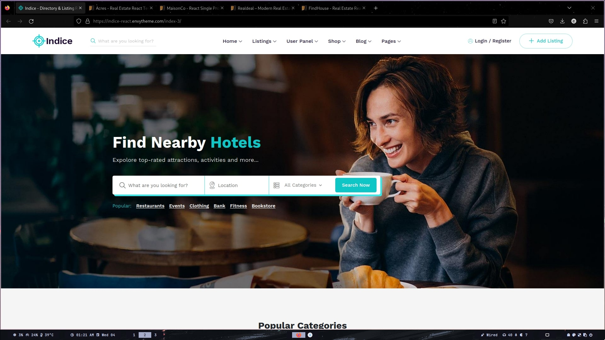
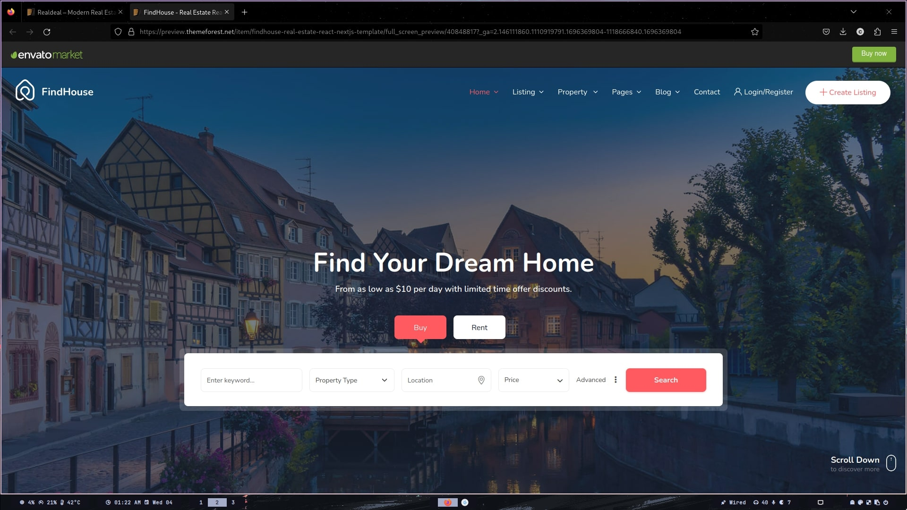
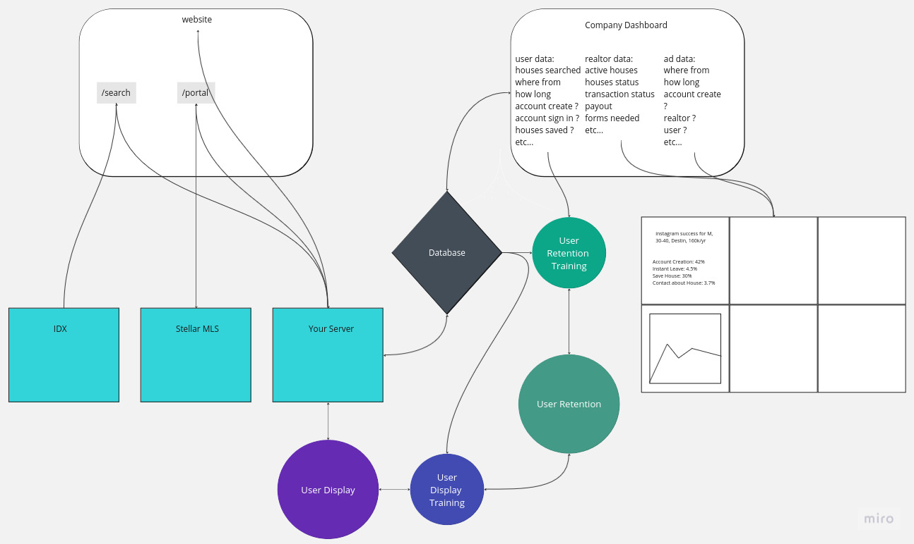

# //World Impact Real Estate | //USA1031.com

### Overview of Industry Standards in Web & Marketing
### If you are not reading this on github and the display is code open the README.pdf

---

## Table of Contents
1. [Intro](#Intro)
    - [What I Can Provide](#What-I-Can-Provide)
    - [In-House Tech vs. Ad Agency](#In-House-Tech-vs-Ad-Agency)
    - [Is This Necessary?](#Is-This-Necessary)
    - [Current State of Web Development](#Current-State-of-Web-Development)
    - [Upsides](#Upsides)
    - [Downsides](#Downsides)

2. [Broad Vision](#Broad-Vision)
3. [Scoped Vision](#Scoped-Vision)
4. [Roadmap](#Roadmap)
    - [Non-Technical](#Non-Technical)
    - [Technical](#Technical)
5. [Referal System](#Referal-System)
    - [Portal Access](#Portal-Access)
        - [Partner Privileges](#Partner-Privileges)
        - [Standard Privileges](#Standard-Privileges)
6. [Marketing Emphasis](#Marketing-Emphasis)
    - [Social Media](#Social-Media)
    - [User Experience](#User-Experience)
    - [Data Analytics](#Data-Analytics)
7. [Flow Chart](#Flow-Chart)
8. [Tools & Libraries](#Tools-&-Libraries)


## Intro
<div style="font-size: 1.1rem">
<p>I put together a low-level overview of the processes that it takes to get your foot in the door to the web landscape and the infrastructure needed to reach a national market.</p>

<p> By trade I am a data scientist. Data scientist for web companies are programmers that collect data then create mathematical models to predict and guide outcomes of users engagement. Along the way I have gained experience using React/Nextjs, then integrating with backend servers and databases.</p>

<p>I'm very confident in my ability to get this endeavor started and opening the door for what you guys envision the company being in the future. I also believe that the plan is realistic and achievable. Taking a long working business model and being one of the fist to apply a virtual interface to it. However there are risks introduced when expanding into tech.</p>

### What I Can Provide:
- Create content that is tailored to each user on the website.
- Target users that are most likely to use your services and consume your content.
- Create a database of users and their interactions with the website.
- Provide visualizations of user data and interactions with the website and social media content.
- Merge the two existing websites into one Web App, centralizing the company's online presence.
- Create a referal system and virtual interface for partner realtors and standard realtors.
- An updated, modernized website.

### In House Tech vs Ad Agency:
- The company will have full control and profits over the data. Being able to sell the data to other companies (realtors, investors, ad agencies, etc...).

- The ad agencies can not function without the data that the company provides. Hiring a competent ad agency will come at a cost of purchasing the data from the another similar company. At scale this will be a major expense with no way to profit other than their success.
- Scale, the company will be able to expand to a national market. Ad agencies will be limited to the local market.

### Is This Necessary:
- Yes and no, the barrier to entry into a national market is applying analytics and data correctly and resourcefully.

- For a majority of companies, and even this company as of now this is overkill.
- If the company is fully committed to expanding into a national market, building a techincal base foundation to scale off of is necessary.
- I would say at a bare minimum that a website update is necessary. The current website is not very UI friendly and is not optimized for the current mess that is web development. 

### Current State of Web Development:
- What most people think SEO has been outdated for some years since large companies started using a code framework called 'React'. 

- React isnt any better than a regular site, but machines are stupid. So when they see all the clicks going to popular sites using React they link it towards success.
- React introduced an unecessary complexity to web development for the majority of websites, bringing it from simply making a wordpress site to running mini programs and processes within your website. This performance boost is not necessary for most websites, but due to the way Google ranks websites it is necessary to compete with other websites.
- Most small companies don't have in their budget to pay a programmer to create and maintain a codebase for their website. So they are stuck with the old wordpress, weebly, wix, etc... websites. Giving an advantage to companies that can afford to pay a programmer to create and maintain a codebase for their website.
- The current industry standard for measuring page ranking oustide of clicks is called Lighthouse, built into every Google Chrome. It is a tool that analyzes the website and gives it a score based on a few different categories.   
-  Lighthouse: 
    - Performance | optimization and speed of website in different environments
    - Accessibility | ease of use for less abled users (blind, deaf, etc...)
    - Best Practices | up-to-date javascript, type safety, and valid APIs
    - SEO | meta tags, keywords, etc...
    - Progressive Web App | uses modern web technologies to provide a native app experience

### Upsides:
- Ability to expand from a big fish in a small pond to a small fish in a big pond.

- Increase in advertisement and notoriety. 
- Access to user data and analytics which can be used or sold to other companies.
- Major boost to referrals and partnerships around the nation.
- Cheap to host. Only $20/mo + IDX fees.
- Maintainable by one person or a small team for the foreseeable future. Once it is not, the company will have gained more than enough profit to afford a team capable of maintaining and expanding it.

### Downsides:
- Complexity, the company will have to learn and adapt to the new technology. Anyone working on the expansion team will have to be able to understand how to use the new technology.  

- Removes the ability of company employees being able to maintain the website.
- Requires professional software engineers and data scientists to maintain and expand. Since these opportunities are only opened by developers and data scientist, the occupations are very competitive and expensive. \
via https://www.glassdoor.com/index.htm
```
    Software Engineer: $139,606 /yr 
    Senior Software Engineer: $176,434 /yr 
    Lead Software Engineer: $195,868 /yr
    Data Scientist: $143,997 /yr 
    Senior Data Scientist: $204,089 /yr 
    Lead Data Scientist: $197,743 /yr
```

</div>

## Broad Vision:
- Increase online presence through social media


## Scoped Vision:
- Add partner realtor referal system

- Add standard realtor referal system 
- Reallocate marketing emphasis to social media
- Create youtube content 
- Create instagram content
- Create social media ads

## Roadmap:

### Non-Technical:
#### Pre Launch:
1. Select theme for website and social media
    - Links to Web App templates and other related websites using Next/React
      - https://seasidefl.com/
      - https://indice-react.envytheme.com/index-4/
      - https://indice-react.envytheme.com/index-3/
      - http://preview.themeforest.net/item/acres-real-estate-react-template/full_screen_preview/29896485?_ga=2.83729750.1110919791.1696369804-1118666840.1696369804
      - https://preview.themeforest.net/item/maisonco-react-single-property-template/full_screen_preview/24793144?_ga=2.137132144.1110919791.1696369804-1118666840.1696369804
      - https://preview.themeforest.net/item/realdeal-real-estate-react-template/full_screen_preview/26673743?_ga=2.116759878.1110919791.1696369804-1118666840.1696369804
      - https://preview.themeforest.net/item/findhouse-real-estate-react-nextjs-template/full_screen_preview/40848817?_ga=2.146111860.1110919791.1696369804-1118666840.1696369804

2. Select content and target audience for social media
    - Investing, Showcase, Tour, Education, etc...
    - Target Audience: Investors, Realtors, Homeowners, Home Searchers etc...
#### Post Launch:
1. Roll out sample advertisements to our top test target audiences 

2. Get feedback and results from advertisements and adjust accordingly

### Technical:

#### Launch ( eta. ~30-40 days ) 

| Task                              | Plan | Develop | Test | Integrate | 
|:---------------------------------:|:----:|:-------:|:----:|:---------:|
| Merge both existing websites into one 'Web App' | 2d | 10d | 2d | |
| Integrate a company database | 1d |  | 1d | 1d |
| Integrate Referal System | 1d | 5d | 2d | 1d |
| Integrate Comm Sockets | 1d | 2d | 2d | 1d |
| Unforseen Issues |  | 1wk |  |  |
| Launch Website | 2d |  | 3d |  |
| Web Scraping Tools/Library | 1d | 5d | 2d | 1d |
| Model to provide unique interactions |  | 3d | 1d | 1d |


## Referal System:

### Portal Access:
-  Homes Listed

-  Homes Status (sold/delisted/etc...)
- Referals Homes Listed 
- Referals Homes Status (sold/delisted/etc...)
- Contact System (send & display files, messaging)

#### Partner Privileges:
- View Active and Past Homes Listed and Status

- View Their Referals Active and Past Homes Listed and Status
- Send Files -> Broker , Send Messages -> Broker & Referal(User)

#### Standard Privileges:
- View Active and Past Homes Listed and Status

- Send Files -> Broker , Send Messages -> Broker & Partner(User)

## Marketing Emphasis:

### Social Media:
- Start using a uniform brand theme for all social media platforms

- More social media friendly logo design 
  - Fits in a squared image
  - Displays well in links
- Partner Affiliate Ads design and scheduling
- Content creation scheduling

### User Experience:
- Improve UI/UX of website, links, and social media themes

- Implement modern Google Algorithm SEO practices (Lighthouse)
  -  Lighthouse: 
      - Performance, optimization and speed of website
      - Accessibility, ease of use for less abled users (blind, deaf, etc...)
      - Best Practices, up-to-date javascript, APIs
      - SEO
      - Progressive Web App

### Data Analytics:
- Google Analytics

- Next Analytics
- Website Analytics
- Social Media Analytics
- Filter ads to target specific demographics on best performing platforms
- Create content to target specific demographics on best performing platforms


## Examples:
<table>
  <tr>
    <td></td>
    <td></td>
  </tr>
  <tr>
    <td></td>
    <td></td>
  </tr>
</table>


## Flow Chart


## Tools & Libraries:
Zillow uses a framework/platform that uses Next.js ( https://nextjs.org/showcase ). \
They do twitch, tiktok, uber, facebook, target, hulu, netflix, and a bunch of other companies. 

They are essentially a company that provides a wrapper around AWS and other cloud services providing a more user friendly experience for the entire company, adding dashboards for non-developers and easy tool access for developers.

Since the run on AWS, they are able to provide a lot of the same services for free as AWS. 

Frontend: 
- Nextjs/React
  - Socket comm for real-time updates
  - API req for storage and functions

Backend:
- Go
  - 1 million execution units / mo
  - 128 MB cache
- IDX
  - Serves directly to frontend
- StellarMLS
  - Serves directly to frontend

Database :
- Vervel KV 
  - 150,000 Requests / mo

Data Visualization & Models:
- Python
